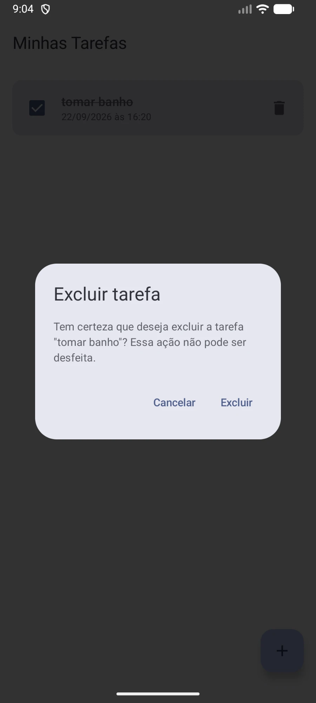
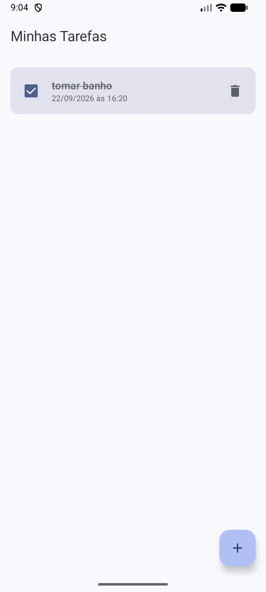
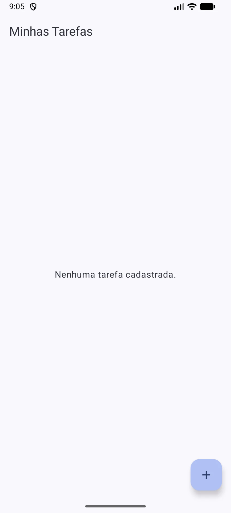

# Evidências — Confirmação de exclusão de tarefas

Sequência de telas do emulador demonstrando o fluxo de confirmação de exclusão implementado em [`ListaTarefasScreen.kt`](app/src/main/java/com/github/cesarb98/fiaptodolist/ui/ListaTarefasScreen.kt).

## 1. Lista antes da exclusão

## 2. Diálogo aberto com a tarefa selecionada

## 3. Resultado ao cancelar

## 4. Nova abertura do diálogo

## 5. Resultado após confirmar a exclusão

