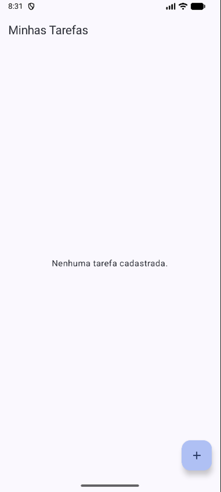
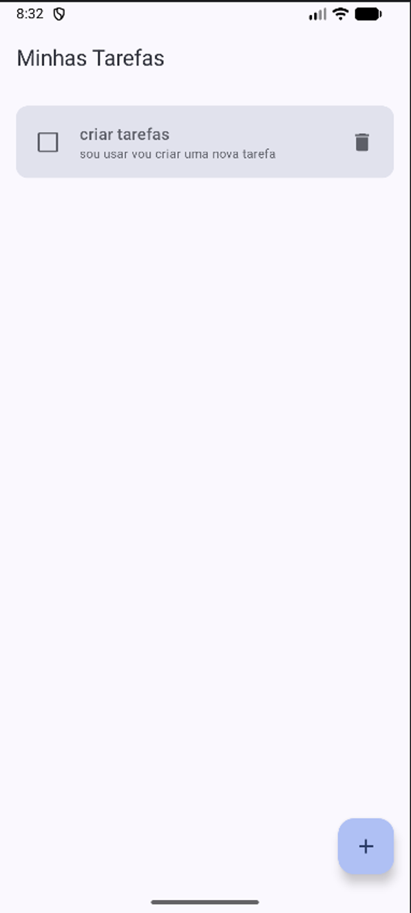
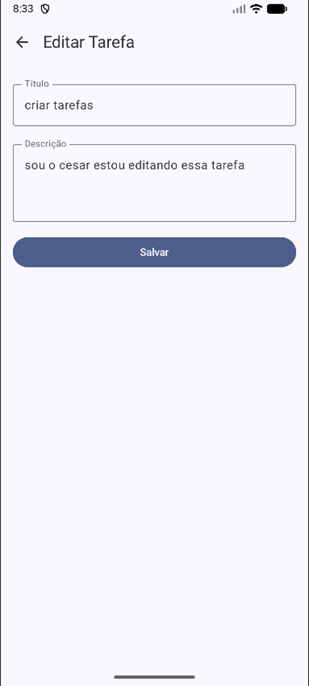
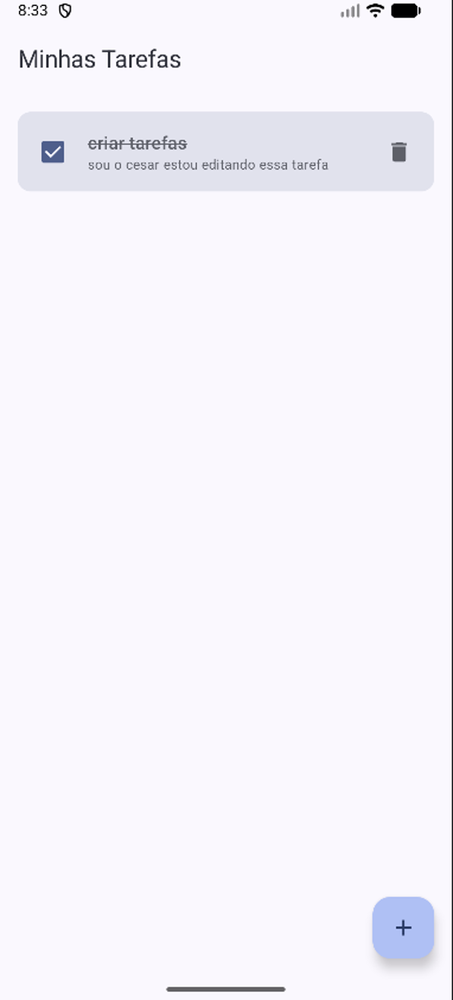
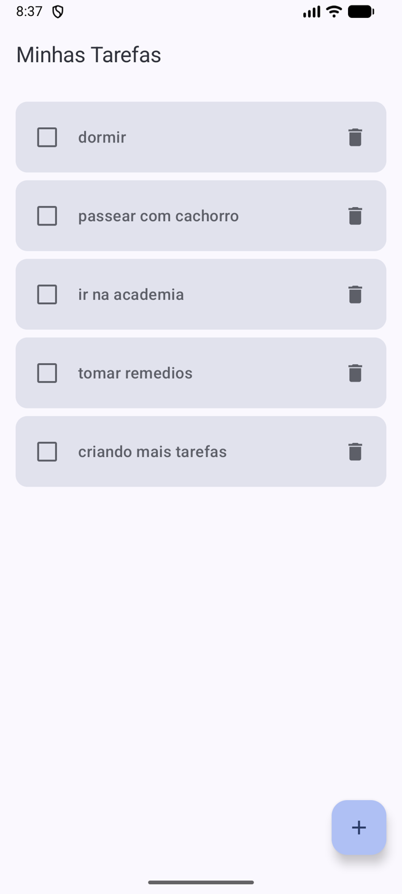

# FIAP To-Do List 📝

Aplicativo de gerenciamento de tarefas desenvolvido como parte das atividades da FIAP. Permite ao usuário criar, visualizar, editar, concluir e excluir tarefas, com persistência local garantida mesmo após o fechamento do app.

## Índice

- [Descrição do Projeto](#descrição-do-projeto)
- [Tecnologias Utilizadas](#tecnologias-utilizadas)
- [Arquitetura e Implementação](#arquitetura-e-implementação)
- [Como Executar o Projeto](#como-executar-o-projeto)
- [Evidências](#evidências)

## Descrição do Projeto

Este é um aplicativo de gerenciamento de tarefas (to-do list) que permite ao usuário:

- Criar novas tarefas
- Visualizar a lista completa de tarefas
- Editar tarefas existentes
- Marcar tarefas como concluídas
- Excluir tarefas

Todos os dados são persistidos localmente, garantindo que nada se perca ao fechar o aplicativo.

## Tecnologias Utilizadas

| Tecnologia | Finalidade |
|---|---|
| **Kotlin** | Linguagem de programação principal |
| **Jetpack Compose** | Kit de ferramentas moderno para construção de UI nativa |
| **Room Database** | Biblioteca de persistência para armazenamento local de dados |
| **Coroutines & Flow** | Manipulação de dados de forma assíncrona e reativa |
| **ViewModel** | Gerenciamento de estado da UI sensível ao ciclo de vida |
| **Navigation Compose** | Navegação entre telas de forma declarativa |

## Arquitetura e Implementação

O projeto segue o padrão **MVVM (Model-View-ViewModel)**, separando claramente a camada de dados, a lógica de negócio e a interface.

### 1. `TarefaRepository`

Atua como camada de abstração entre o banco de dados Room e o ViewModel. Centraliza o acesso aos dados, decidindo de onde as informações vêm e para onde vão, promovendo a separação de conceitos.

### 2. `TarefaViewModel`

Gerencia o estado da interface. Suas responsabilidades incluem:

- Converter o `Flow` de dados do repositório em um `StateFlow` observável pela UI;
- Disparar operações de escrita/deleção em threads secundárias usando `viewModelScope.launch`;
- Manter a lógica de negócio separada dos componentes visuais.

### 3. `ListaTarefasScreen`

Observa a lista de tarefas através do `StateFlow` exposto pelo ViewModel. Sempre que o banco de dados é alterado, o `Flow` emite uma nova lista e a UI se recompõe automaticamente para refletir as mudanças (como marcar uma tarefa como concluída). As ações do usuário (clique, exclusão) são disparadas como funções chamadas no ViewModel.

### 4. `FormularioTarefaScreen`

O formulário diferencia a criação da edição através da presença ou ausência de um ID de tarefa:

- Se um ID válido for passado, a tela carrega os dados existentes para edição;
- Caso contrário, ela inicia com campos vazios para um novo cadastro.

### 5. `AppNavigation` e Rotas

A navegação é gerenciada por um `NavHost`. As rotas configuradas são:

| Rota | Descrição |
|---|---|
| `lista` | Tela principal com todas as tarefas |
| `formulario/{tarefaId}` | Tela de cadastro/edição. O `tarefaId` é um argumento opcional; quando presente, identifica que se trata da edição de uma tarefa específica |

### 6. `MainActivity`

Ponto de entrada do aplicativo. Responsável por:

- Configurar o `enableEdgeToEdge` para um design moderno;
- Instanciar o `TarefaViewModel` utilizando uma factory, garantindo que o `applicationContext` seja passado para o banco de dados;
- Iniciar o `AppNavigation`, fornecendo o ViewModel único para todas as telas.

## Como Executar o Projeto

**Pré-requisitos:**

- Android Studio Koala (ou superior)
- Dispositivo físico ou emulador com API 24 ou superior

**Passo a passo:**

1. Clone este repositório:
   ```bash
   git clone <url-do-repositorio>
   ```
2. Abra o projeto no Android Studio.
3. Aguarde a sincronização do projeto com os arquivos Gradle (Sync Project with Gradle Files).
4. Execute o aplicativo (`Run ▶`) em um emulador ou dispositivo físico com API 24 ou superior.

## Evidências

### Tela de Lista (vazia)



### Cadastro de Tarefa


### Lista com Tarefa Cadastrada



### Edição de Tarefa



### Tarefa Concluída



### Lista com Múltiplas Tarefas



---

Desenvolvido como parte das atividades acadêmicas da **FIAP**.
